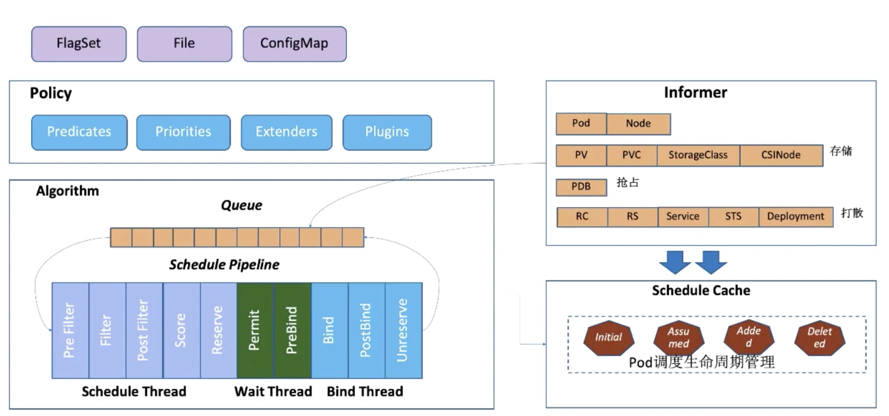

- **Policy**: 调度策略用于指定调度主流程中要用哪些过滤器 (Predicates)、打分器 (Priorities) 、外部扩展的调度器 (Extenders)，以及最新支持的 SchedulerFramwork 的自定义扩展点 (Plugins)。目前支持三种方式，配置文件 / 命令行参数 / ConfigMap。
- **Informer**: Scheduler 在*启动时*通过 K8s 的 informer 机制以(List+Watch)从 apiserver 获取调度需要的数据例如：Pods、Nodes、Persistant Volume(PV), Persistant Volume Claim(PVC) 等等，并将这些数据做一定的预处理作为调度器的的 Cache。
- **Schedule Pipeline**: 通过 Informer 将需要调度的 Pod 插入 Queue 中，Schedule Pipeline 会循环从 Queue Pop 等待调度的 Pod 放入 Pipeline 执行。主要有三个阶段Scheduler Thread，Wait Thread，Bind Thread, 整个调度流水线只有在 Scheduler Thread 阶段是串行的一个 Pod 一个 Pod 的进行调度，在 Wait 和 Bind 阶段 Pod 都是异步并行执行。
    - Scheduler Thread 阶段: Schduler Thread 会经历 Pre Filter -> Filter -> Post Filter-> Score -> Reserve(可以简单理解为 Filter -> Score -> Reserve)
      * Filter: 选择符合 Pod Spec 描述的 Nodes；
      * Score: 对从 Filter 过后的 Nodes 进行打分和排序；
      * Reserve: 将 Pod 跟排序后的最优 Node 的 NodeCache 中，表示这个 Pod 已经分配到这个 Node 上, 让下一个等待调度的 Pod 对这个 Node 进行 Filter 和 Score 的时候能看到刚才分配的 Pod。
    - Wait Thread 阶段: 等待 Pod 关联的资源的 Ready 等待，例如等待 PVC 的 PV 创建成功，或者 Gang 调度中等待关联的 Pod 调度成功等等；
    - Bind Thread 阶段: 将 Pod 和 Node 的关联通过 APIServer 持久化 ETCD 

Scheduler 启动的时候所有等待被调度的 Pod 都会进入 activieQ, activeQ 会按照 Pod 的 priority 进行排序
Scheduler Pipepline 会从 activeQ 获取一个 Pod 进行 Pipeline 执行调度流程
- 当调度失败之后会直接根据情况选择进入 unschedulableQ 或者 backoffQ，如果在当前 Pod 调度期间 Node Cache、Pod Cache 等 Scheduler Cache 有变化就进入 backoffQ，否则进入 unschedulableQ

unschedulableQ 会定期较长时间（例如 60 秒）刷入 activeQ 或者 backoffQ，或者在 Scheduler Cache 发生变化的时候触发关联的 Pod 刷入 activeQ 或者 backoffQ；

backoffQ 会以 backoff 机制相比 unschedulableQ 比较快地让待调度的 Pod 进入 activeQ 进行重新调度


```mermaid
sequenceDiagram
autonumber
    participant Pipepline
    participant activeQ
    participant backoffQ
    participant unschedulableQ
    participant PodCache 
    participant NodeCache 
    PodCache->>activeQ: 启动的时候所有等待被调度的 Pod 都会进入 activieQ
    activeQ->>activeQ: 按照 Pod 的 priority 进行排序

    Pipepline->>activeQ: 获取一个 Pod 进行 Pipeline 执行调度流程
    alt 成功 Schedule
        Pipepline->>NodeCache: 从 NodeCache 拿到相关的 Node
        par Scheduler Thread 阶段
            Pipepline->>Pipepline: 执行 Filter 逻辑 (Pre Filter -> Filter -> Post Filter)
            Pipepline->>Pipepline: 执行 Score 逻辑
            Pipepline->>Pipepline: 执行 Reserve 逻辑, 对有状态的 plugin 可以对资源做内存记账
        and Wait Thread 阶段
            Pipepline->>Pipepline: 执行 Permit 逻辑, (wait、deny、approve)
            Pipepline->>Pipepline: 执行 PreBind 逻辑, 在bind node 之前，执行一些操作，例如：云盘挂载盘到 Node 上
        and Bind Thread 阶段
            Pipepline->>Pipepline: 执行 Bind 逻辑, 一个 Pod 只会被一个 BindPlugin 处理
            Pipepline->>Pipepline: 执行 PostBind 逻辑, 比如可以用于 logs/metircs
            Pipepline->>Pipepline: 执行 Unreserve 逻辑, 在 Permit 到 Bind 这几个阶段只要报错就回退
        end
        Pipepline->>NodeCache: 123
    else 失败 Schedule
        Pipepline->>backoffQ: Scheduler Cache 有变化, 将 Pod 刷入 backoffQ
        Pipepline->>unschedulableQ: Scheduler Cache 无变化, 将 Pod 刷入 unschedulableQ
    end

    Pipepline->>activeQ: 获取一个 Pod 进行 Pipeline 执行调度流程
    loop Schedule
        Pipepline->>Pipepline: 调度失败
    end
    

    unschedulableQ->>backoffQ: 定时tiger, Scheduler Cache 有变化tiger
    unschedulableQ->>activeQ: 定时tiger, Scheduler Cache 有变化tiger
    backoffQ->>activeQ: 12


